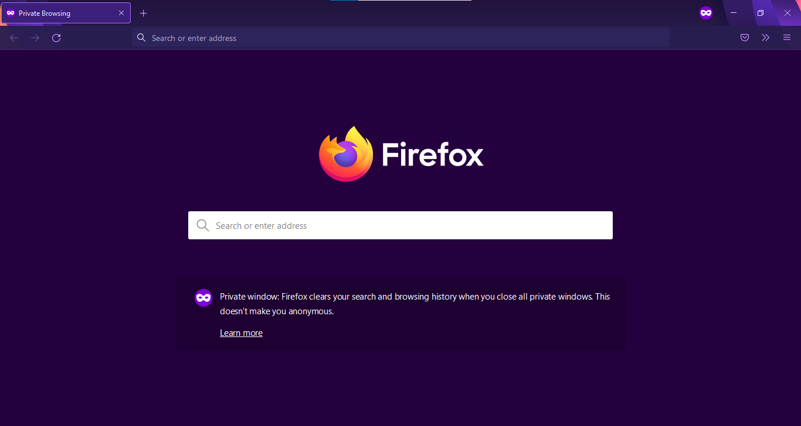

# Alpenglow Dark Private Windows

Alpenglow Dark will be your theme when you open a new Private Window but not in normal windows.

This theme is based on [Alpenglow Dark](https://addons.mozilla.org/en-US/firefox/addon/alpenglow-dark/) by [Prajna Sariputra](https://github.com/X-m7/alpenglow-dark), with the code for changing the theme on private windows only copied/based from [Purple Private Windows](https://addons.mozilla.org/en-US/firefox/addon/purple-private-windows/) by [WaldiPL](https://github.com/WaldiPL/purplePrivateWindows).

Download [Here](https://github.com/julzaves/alpenglow-dark-private-windows#download).

## Screenshots

## Download
https://www.mediafire.com/file/9n9g19py0qh6s99/Alpenglow_Dark_Private_Windows-1.0.xpi/file
